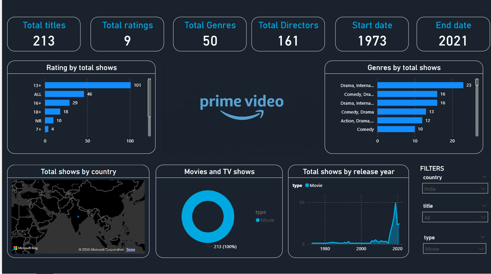

# 🎬 Prime Video Dashboard | Power BI

## 📌 Project Overview

This project presents an interactive Power BI dashboard that analyzes Prime Video content. It provides insights into ratings, genres, release trends, directors, countries, and content distribution.

---

## Dashboard Preview

---

## Features

- Total Titles
- Total Ratings
- Total Genres
- Total Directors
- Content by Rating
- Genre Analysis
- Release Year Trend
- Country-wise Distribution
- Interactive Filters

---

## Key Insights

- Total Titles: **213**
- Ratings Categories: **9**
- Genres: **50**
- Directors: **161**
- Content Range: **1973–2021**
- Drama is the most common genre.
- Most titles were released after 2015.

---

## Tools Used

- Power BI
- Power Query
- DAX
- Data Visualization

---

## Files

| File | Description |
|------|-------------|
| PrimeVideoDashboard.pbix | Power BI project |
| dashboard.png | Dashboard Screenshot |

---

## Skills Demonstrated

- Data Cleaning
- Data Modeling
- DAX Measures
- Dashboard Design
- Business Intelligence
- Data Visualization

---

## Author

**Mufliha CH**

GitHub:
https://github.com/Mufliha-CH

LinkedIn:
LinkedIn: https://www.linkedin.com/in/mufliha-ch/
